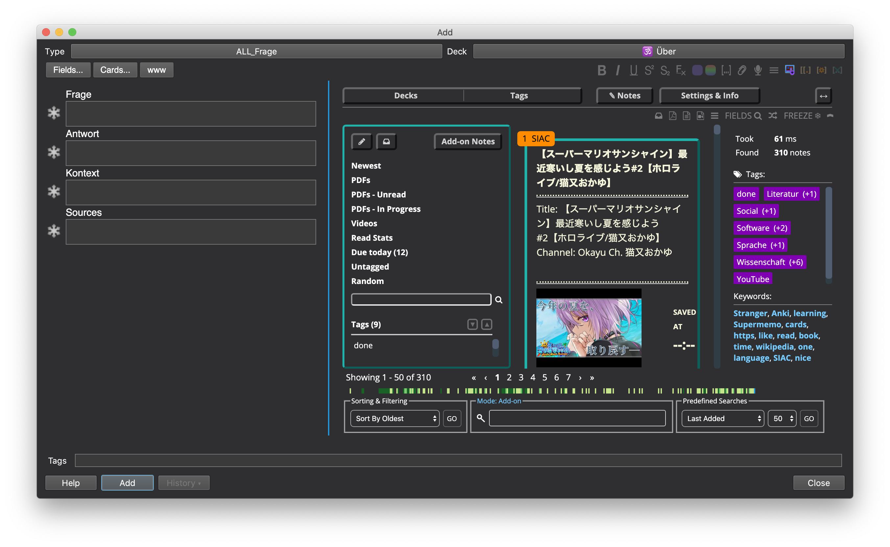

# Search Inside Add Card

## Short description

Search Inside Add Card is an Anki add-on which aids you in the card
creation process. Apart from offering you a search feature in the Add Card dialog,
it will also give you the possibility to create, prioritise and schedule text notes,
PDF files and YouTube videos.

## Key features
### Automated search on type

Automatically search for related notes and

### Importing PDF notes
PDF notes can be imported by dragging them into Anki.
