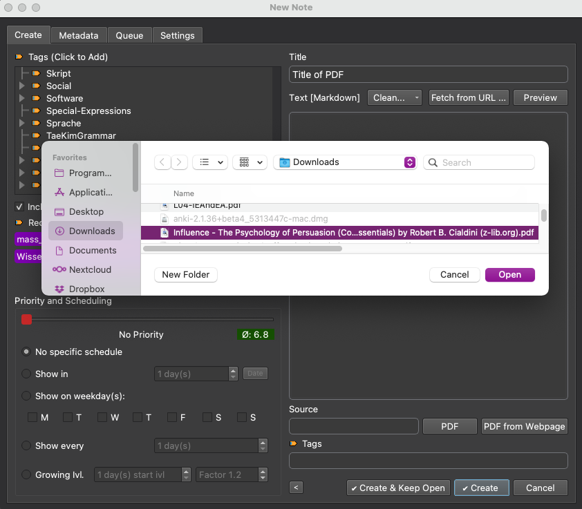

# Importing PDF files

There are three major ways of importing a PDF which will be described here.

## From path
If you have a PDF file located on your hard-drive and want to use it with the SIAC add-on,
this will be what you are looking for. Create a [new add-on note](text/docs/addon_notes#Creating_new_notes) and specify a title. Now open the file browser by pressing the `PDF` button next to the source field and select your desired PDF, or manually enter the PDF source path.

