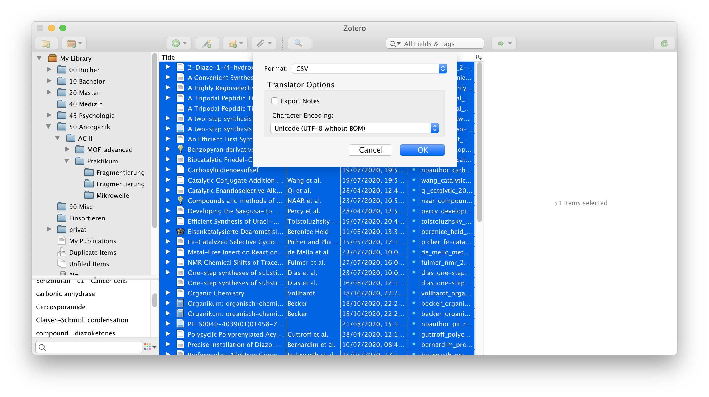
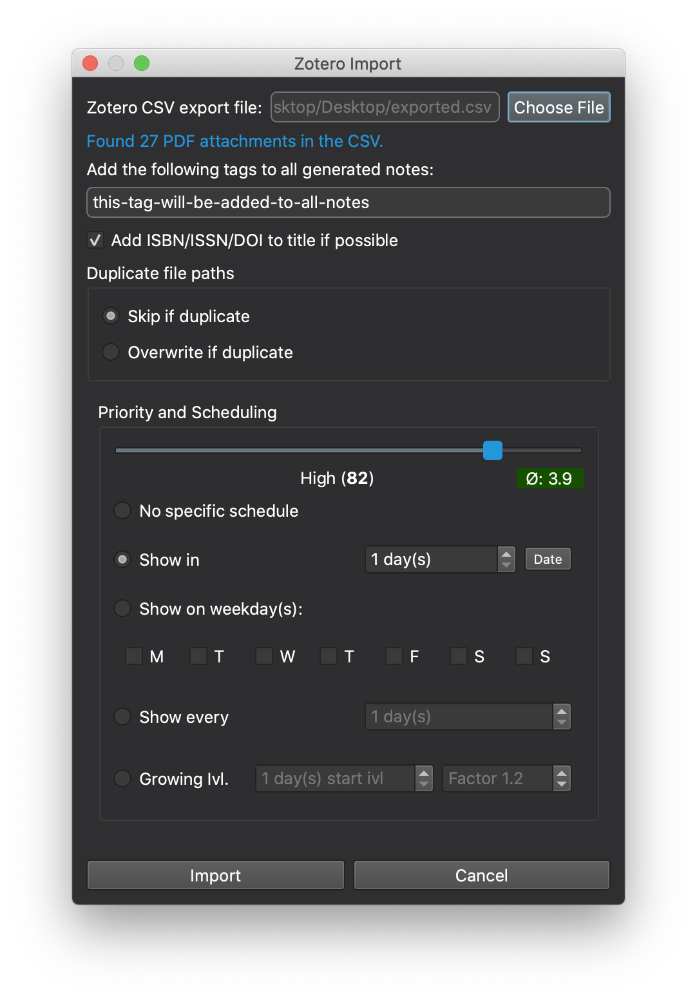

# Importing from Zotero

The add-on offers the ability to bulk-import PDF files from [Zotero](https://www.zotero.org).
This is especially handy if you already have a big collection of scientific papers you finally want to
read.

## Export from Zotero

In Zotero, select all the documents you want to import into the add-on.
Do a right click, and select `Export Notes...`. Set the Format to CSV and export the
file to a suitable location, for expample your Desktop.

!> To keep track of already exported citations, it is helpful to tag them or move
them to a different Zotero collection folder.

## Import in the add-on

In Anki, select `SIAC>Import...>Zotero CSV` in the menubar to open the Zotero Import
Dialog.

Press `Choose File` and select the file you previously exported from Zotero. The add-on
will automatically show you the number of found PDF attachments.

After setting the import parameters to your liking, confirm the import by pressing the button `Import`.

!> Note that the settings for adding the tags, priority and scheduling apply to all
imported PDF notes equally.

!> Depending on the selected behaviour, the Zotero CSV Importer will either *skip* duplicate
PDF files (as indicated by the file path) or *overwrite* them.
